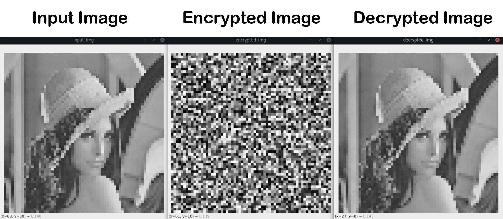

<div align="center">

# 🧩 Image Encryption Process based on Chaotic Synchronization Phenomena 🧩

| **[ [```Slides (PPTX)```](<assets/Image Encryption Process based on Chaotic Synchronization Phenomena.pptx>) ]** | **[ [```Slides (PDF)```](<assets/108118095 - Image Encryption Process based on Chaotic Synchronization Phenomena.pdf>) ]** | **[ [```Reference```](<assets/Image Encryption Process based on Chaotic Synchronization Phenomena.pptx>) ]** |
|:-------------------:|:-------------------:|:-------------------:|

<!-- | **```Outputs```** |
|:-------------------:| -->

# Outputs



<!-- | **```Circuit```** |
|:-------------------:| -->

# Circuit


---

</div>

# Usage 👨‍💻
Please refer to the slides provided. It is extensively documented. 

# Citation 📜
```BibTeX
@article{DBLP:journals/sigpro/VolosKS13,
  author    = {Christos K. Volos and
               Ioannis M. Kyprianidis and
               Ioannis N. Stouboulos},
  title     = {Image encryption process based on chaotic synchronization phenomena},
  journal   = {Signal Process.},
  volume    = {93},
  number    = {5},
  pages     = {1328--1340},
  year      = {2013},
  url       = {https://doi.org/10.1016/j.sigpro.2012.11.008},
  doi       = {10.1016/j.sigpro.2012.11.008},
  timestamp = {Sat, 22 Feb 2020 19:21:12 +0100},
  biburl    = {https://dblp.org/rec/journals/sigpro/VolosKS13.bib},
  bibsource = {dblp computer science bibliography, https://dblp.org}
}
```
